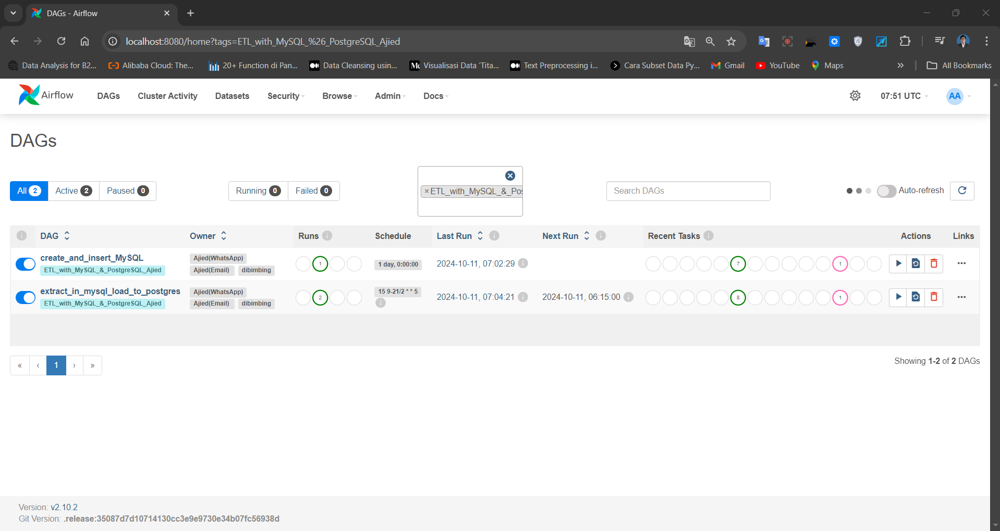
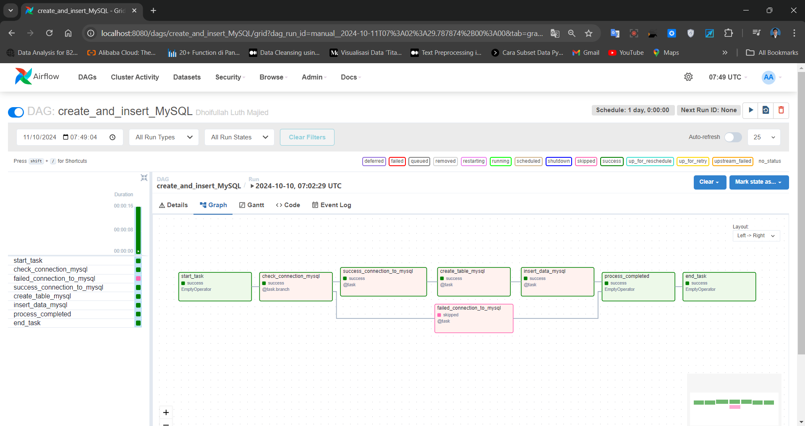
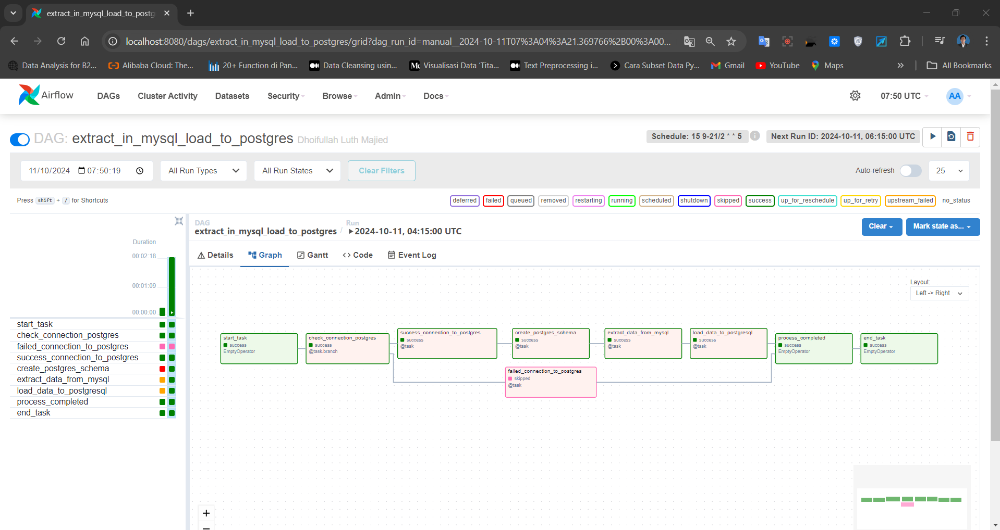
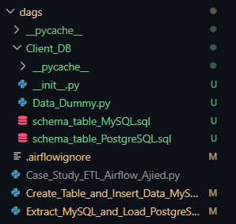
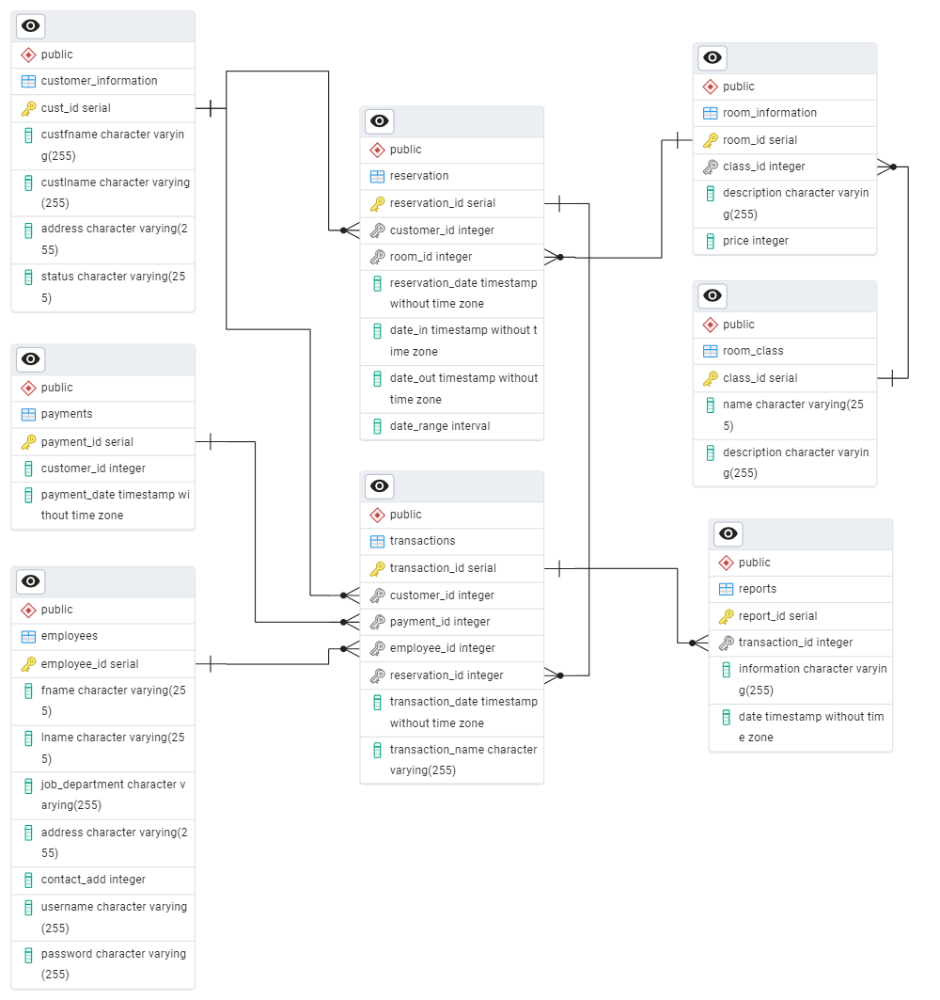
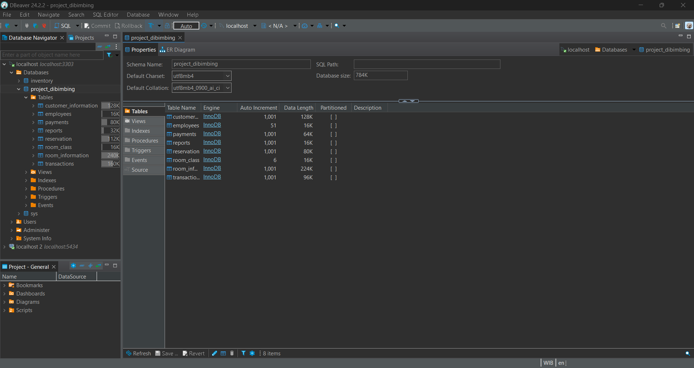
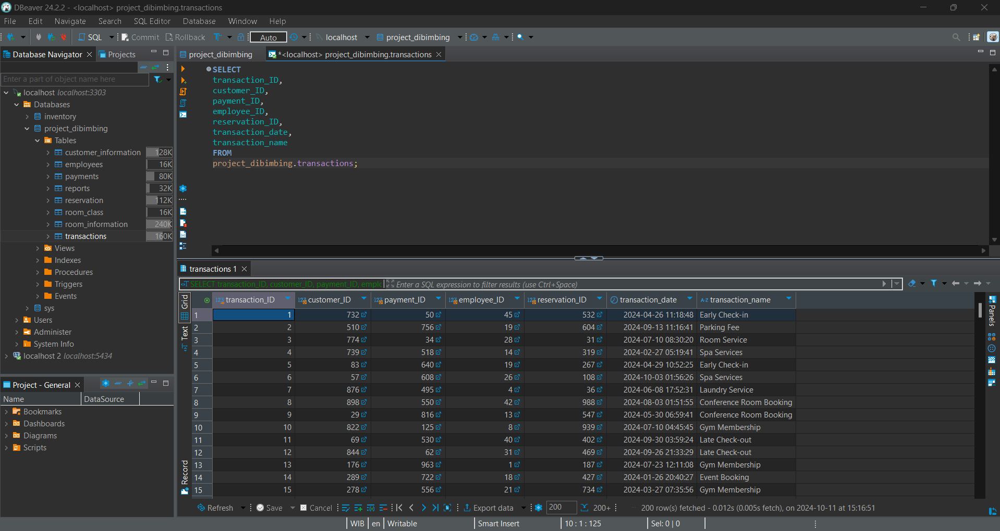
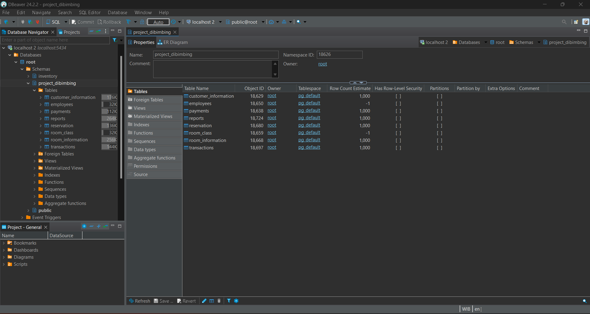
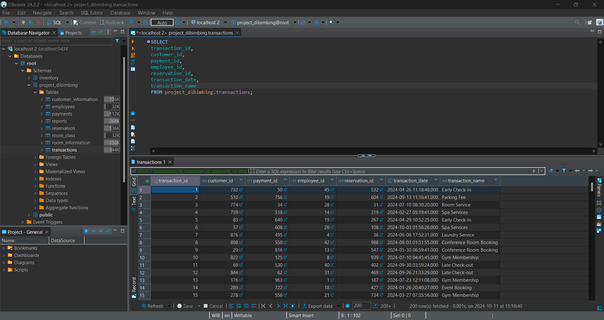

# Assignment Guidance: Case Study ETL Airflow Part II

    

## Deskripsi Proyek
Proyek ini bertujuan untuk memasukkan data dummy ke dalam database MySQL untuk data staging lalu akan dilakukan proses extract dan load ke database PostgreSQL yang akan digunakan untuk keperluan pengujian, simulasi, dan pengembangan aplikasi. Dengan menggunakan library Python seperti Faker, Random dan komponen metode di apache airflow. Data yang di hasilkan secara acak dan disimpan dalam berbagai tabel. untuk tema data adalah manajemen hotel.

## Prasyarat proyek
Sebelum menjalankan proyek ini, pastikan Anda telah menginstal perangkat lunak berikut:

- Python : Digunakan untuk menjalankan skrip yang menghasilkan data dummy dan Apache Airflow.

- MySQL : Database yang digunakan untuk staging area data dummy.

- PostgreSQL : Database yang digunakan untuk load data dummy.

- Docker Compose : Digunakan untuk menjalankan Apache Airflow, MySQL dan PostgreSQL

- Dbeaver : Digunakan untuk alat basis data lintas untuk pengembang, administrator basis data, analis, dan semua orang yang bekerja dengan data

## Fitur Utama
- **Data_Dummy**: Membuat data untuk keperluan insert data ke dalam database.
- **Schema_Table**: Membuat tabel lalu dihubungkan atau dibuat relasi ya dengan metode star schema dimana ada satu tabel fact.
- **Database_MySQL**: untuk staging area ya itu bernama `project_dibimbing`.
- **Schema_PostgreSQL**: untuk schema ya itu bernama `project_dibimbing`.
- ""schedule_interval**: untuk menjadwalkan proses DAGs pada file yang bernama `Extract_MySQL_and_Load_PostgreSQL.py`.
- **Extract**: Mengambil data dari staging area di **MySQL**.
- **Load**: Menyimpan data hasil extract dan memuatnya ke dalam **PostgreSQL**.
- **Branching**: Pemilihan alur berdasarkan koneksi database dalam bentuK success atau failed.

## Struktur Proyek

├── dags/

│   └── Create_Table_and_Insert_Data_MySQL.py    # Script utama 1 DAG (Bronze)

│   └── Extract_MySQL_and_Load_PostgreSQL.py    # Script utama 2 DAG (Silver (schedule_interval) -> Gold)

└── Client_DB/

│    └── Data_Dummy.py                  # Fungsi membuat data dummy
    
│    └── schema_table_MySQL.sql         # Fungsi membuat database dan ERD tabel di MySQL
    
│    └── schema_table_PostgreSQL.sql    # Fungsi membuat database dan ERD tabel di PostgreSQL
    
└── README.md                           # Dokumentasi proyek ini

## Struktur Data

Skrip Python yang disiapkan dalam proyek ini menggunakan Faker untuk menghasilkan data acak atau random. Data dummy ini mencakup berbagai tabel seperti:

- `customer_information` : Menyimpan informasi pelanggan seperti nama dan alamat.

- `payments` : Menyimpan informasi pembayaran terkait pelanggan.

- `employees` : Menyimpan data karyawan termasuk departemen dan kontak.

- `room_class` : Menyimpan informasi tentang kelas kamar.

- `room_information` : Menyimpan data kamar yang tersedia di hotel.

- `reservation` : Menyimpan data reservasi kamar oleh pelanggan.

- `transactions` : Mencatat transaksi yang terjadi dalam hotel, seperti pemesanan kamar atau layanan tambahan.

- `reports` : Menyimpan laporan terkait transaksi.

## Koneksi Database

`MySQL` :
- Connection Id: id_mysql
- Connection Type: MySQL
- Host: host.docker.internal
- Login: root
- Password: dibimbing
- Port: 3303 (menyesuaikan)

`PostgreSQL` :
- Connection Id: id_postgres
- Connection Type: Postgres
- Host: host.docker.internal
- Login: root
- Password: dibimbing
- Port: 5434 (menyesuaikan)

## Screenshot proyek

- DAGs

    - UI 2 file DAG
      

          
      

- Current Graph DAG

    - Graph di file Create_Table_and_Insert_Data_MySQL
      

          
      

     
    - Graph di file Extract_MySQL_and_Load_PostgreSQL
      

          
      

- Config File

    - File pendukung proyek
      

          
      

- ERD Data

    - Relasi antar tabel
      

          
      

- Database

  - MySQL

    - Database `project_dibimbing`
      

          
      

    - Show data di MySQL pada database `project_dibimbing`
      

          
      

     
  - PostgreSQL

    - Schema `project_dibimbing`
      

          
      

    
    - Show data di MySQL pada database `project_dibimbing`
      

          
      

* `Untuk proses load ke PostgreSQL itu bersifat increamental data jika data yang di extract dari MySQL sudah ada di database PostgreSQL maka tidak akan di load. Jadi, tergantung dari database MySQL ya apakah ada data baru atau ada update baru dan proses schedule_interval dilakukan setelah proses extract selesai pada file Create_Table_and_Insert_Data_MySQL.py lalu di load pada file Extract_MySQL_and_Load_PostgreSQL.py dengan crontab yang sudah diatur...`

Thank You 🤙
