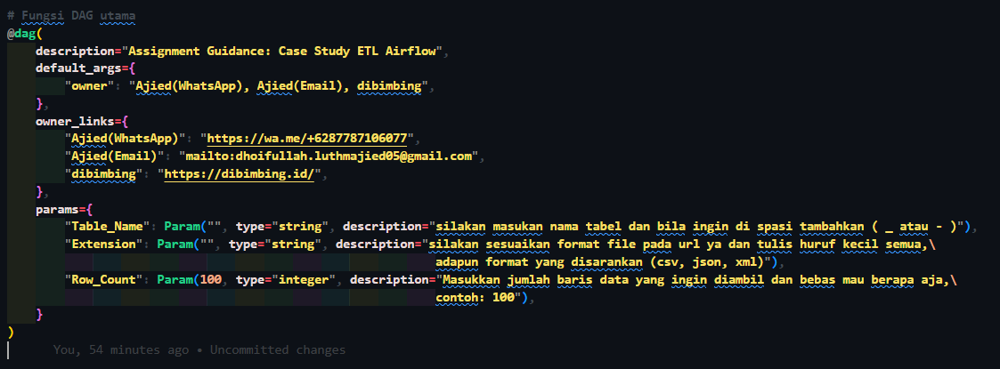
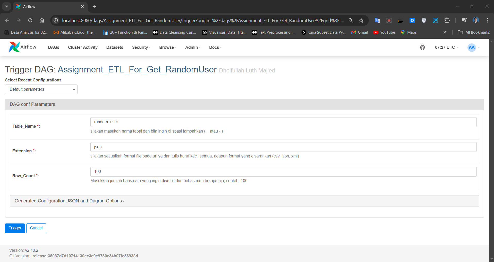
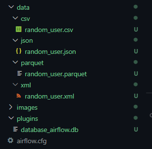
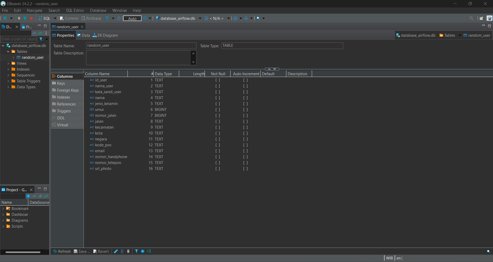
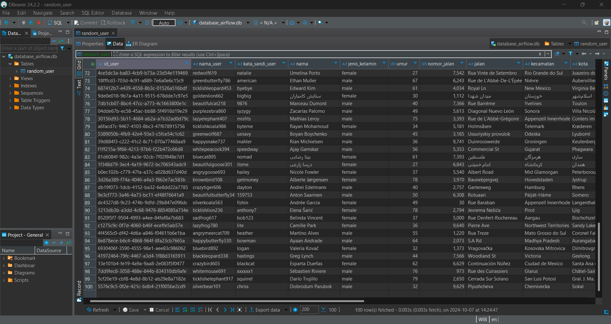
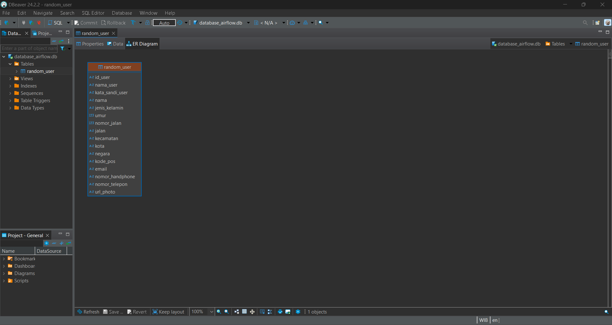

# Assignment Guidance: Case Study ETL Airflow with Docker

    

## Deskripsi Proyek
Proyek ini merupakan implementasi proses ETL (Extract, Transform, Load) menggunakan **Apache Airflow**. Proses ini bertujuan untuk mengambil data dari beberapa sumber (CSV, JSON, XML), melakukan transformasi, dan kemudian menyimpan data ke dalam format **Parquet** dan **SQLite**. Proyek ini menggabungkan tugas-tugas ETL dalam sebuah **DAG (Directed Acyclic Graph)** yang dapat dijalankan dan diatur melalui Airflow.

## Deskripsi Data Sources
randomuser.me adalah sebuah API yang menyediakan data pengguna acak untuk keperluan pengembangan, pengujian, dan demonstrasi. Dengan menggunakan API ini, Anda dapat dengan mudah menghasilkan informasi pengguna yang realistis, termasuk nama, alamat, nomor telepon, foto profil, dan data lainnya.

Fitur Utama:

- Data Acak: Menghasilkan data pengguna yang acak setiap kali permintaan dilakukan.
- Format Beragam: Mendukung berbagai format data, termasuk JSON dan CSV, yang memudahkan integrasi ke dalam aplikasi.
- Customizable: Pengguna dapat mengatur jumlah pengguna yang ingin dihasilkan, serta memilih jenis data yang diinginkan (misalnya, jenis 
  kelamin, lokasi, dll.).

Penggunaan:

randomuser.me sering digunakan oleh pengembang untuk:

- Menguji aplikasi dengan data pengguna palsu.
- Membuat prototipe dan demo tanpa harus menggunakan data nyata.
- Mempercepat proses pengembangan frontend dan backend dengan memberikan data yang relevan dan bervariasi.

API ini sangat berguna bagi pengembang yang membutuhkan data dummy untuk aplikasi mereka tanpa harus membuat data secara manual.

URL       : `https://randomuser.me/`
URL_csv   : `https://randomuser.me/api/?format=csv&results=/`
URL_json  : `https://randomuser.me/api/?format=json&results/`
URL_xml   : `https://randomuser.me/api/?format=xml&results=/`

## Fitur Utama
- **Extract**: Mengambil data dari file berformat CSV, JSON, atau XML.
- **Transform**: Transformasi data yang telah diekstrak sesuai dengan format dan tabel yang ditentukan.
- **Load**: Menyimpan data hasil transformasi ke format **Parquet** dan memuatnya ke dalam **SQLite**.
- **Branching**: Pemilihan alur berdasarkan tipe file (CSV, JSON, XML).
- **Parameterisasi**: Pengguna dapat menentukan tabel tujuan, format file, dan jumlah baris yang ingin diproses melalui parameter DAG.

## Struktur Proyek

├── dags/

│   └── assignment_etl_airflow.py    # Script utama DAG 

└── resources/

│    └── Extract_csv.py               # Fungsi extract untuk file CSV 
    
│    └── Extract_json.py              # Fungsi extract untuk file JSON 
    
│    └── Extract_xml.py               # Fungsi extract untuk file XML 
    
│    └── Transform_csv.py             # Transformasi data CSV 
    
│    └── Transform_json.py            # Transformasi data JSON 
    
│    └── Transform_xml.py             # Transformasi data XML 
    
│    └── save_to_parquet.py           # Menyimpan data ke format Parquet 
    
│    └── Load_data.py                 # Memuat data ke SQLite 
    
└── README.md                        # Dokumentasi proyek ini

## Struktur Data

- `id_user`          # Menyimpan ID pengguna
- `nama_user`        # Menyimpan nama pengguna
- `kata_sandi_user`  # Menyimpan kata sandi pengguna
- `nama`             # Menyimpan nama lengkap pengguna
- `jenis_kelamin`    # Menyimpan jenis kelamin pengguna
- `umur`             # Menyimpan umur pengguna
- `nomor_jalan`      # Menyimpan nomor jalan alamat pengguna
- `jalan`            # Menyimpan nama jalan alamat pengguna
- `kecamatan`        # Menyimpan kecamatan pengguna
- `kota`             # Menyimpan kota pengguna
- `negara`           # Menyimpan negara pengguna
- `kode_pos`         # Menyimpan kode pos pengguna
- `email`            # Menyimpan email pengguna
- `nomor_handphone`  # Menyimpan nomor telepon pengguna
- `nomor_telepon`    # Menyimpan nomor ponsel pengguna
- `url_photo`        # Menyimpan URL foto pengguna

## Screenshot proyek

- Parameter DAG

    - Scricpt Python 
      

          
      

     
    - UI Airflow 
      

          
      

- Current Graph DAG

    - Before current graph running
      

          
      

     
    - after current graph running
      

          
      

- Folder Data

    - Save Data (proses save data dari extract menggunakan url atau scraping web sesuai format data yang diambil lalu di transform untuk di save ke format asli ya dan format parquet)
      

          
      

- SQLite

    - Properties Data
      

          
      

     
    - Show Data
      

          
      

    
    -   Diagram Data
      

          
      

Thank You 🤙
